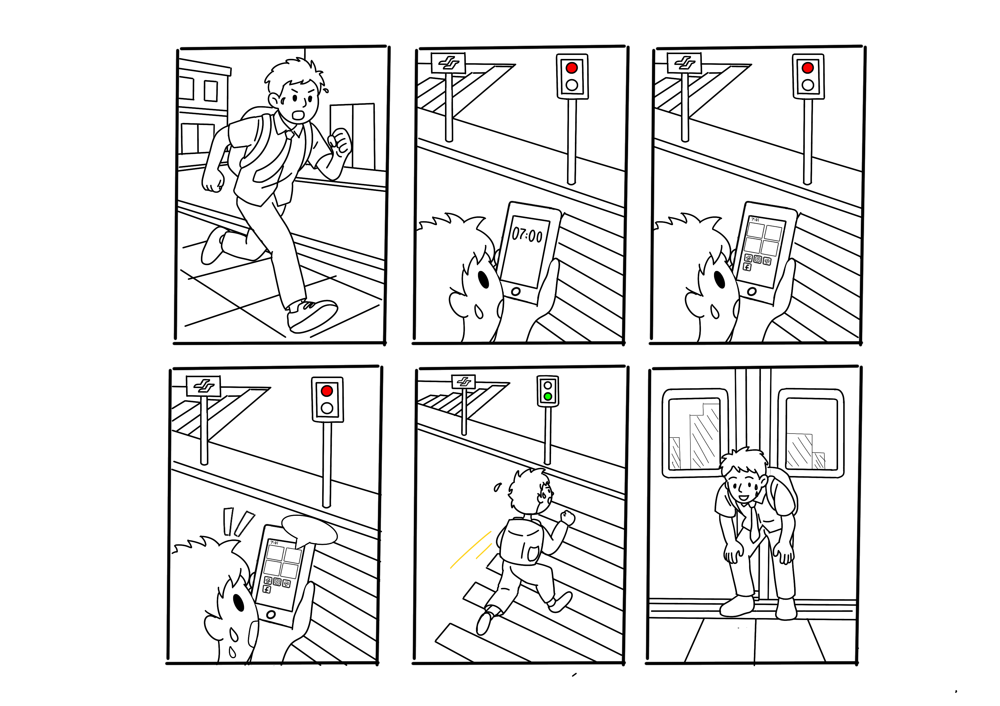
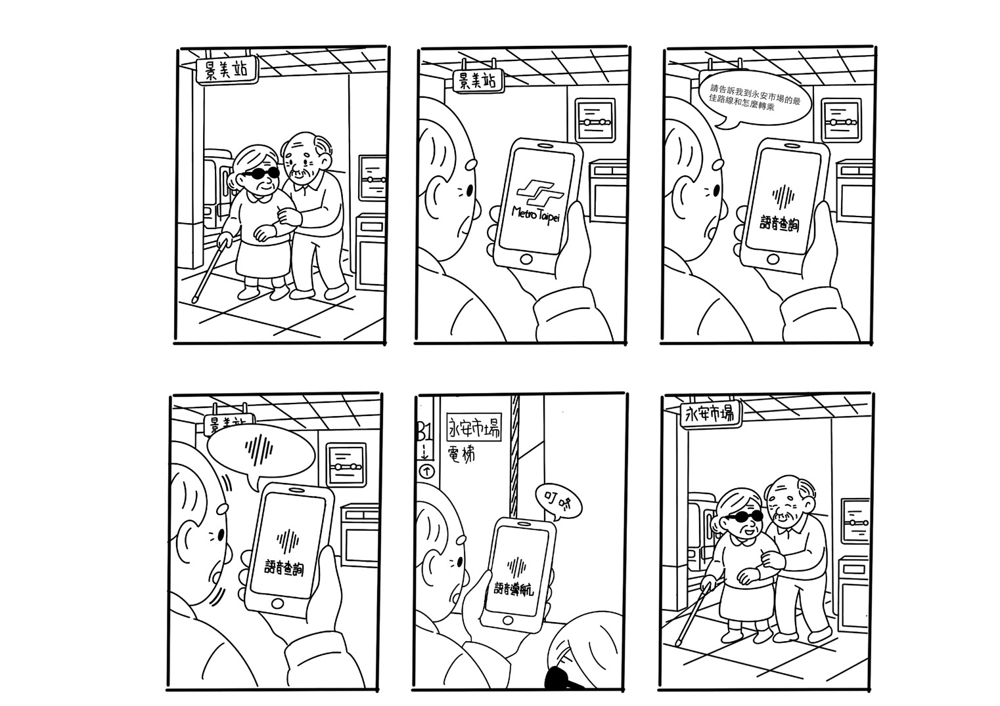
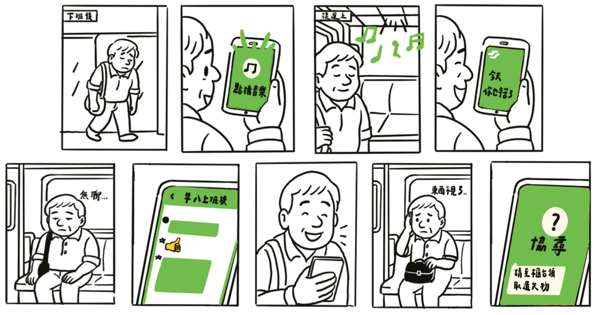
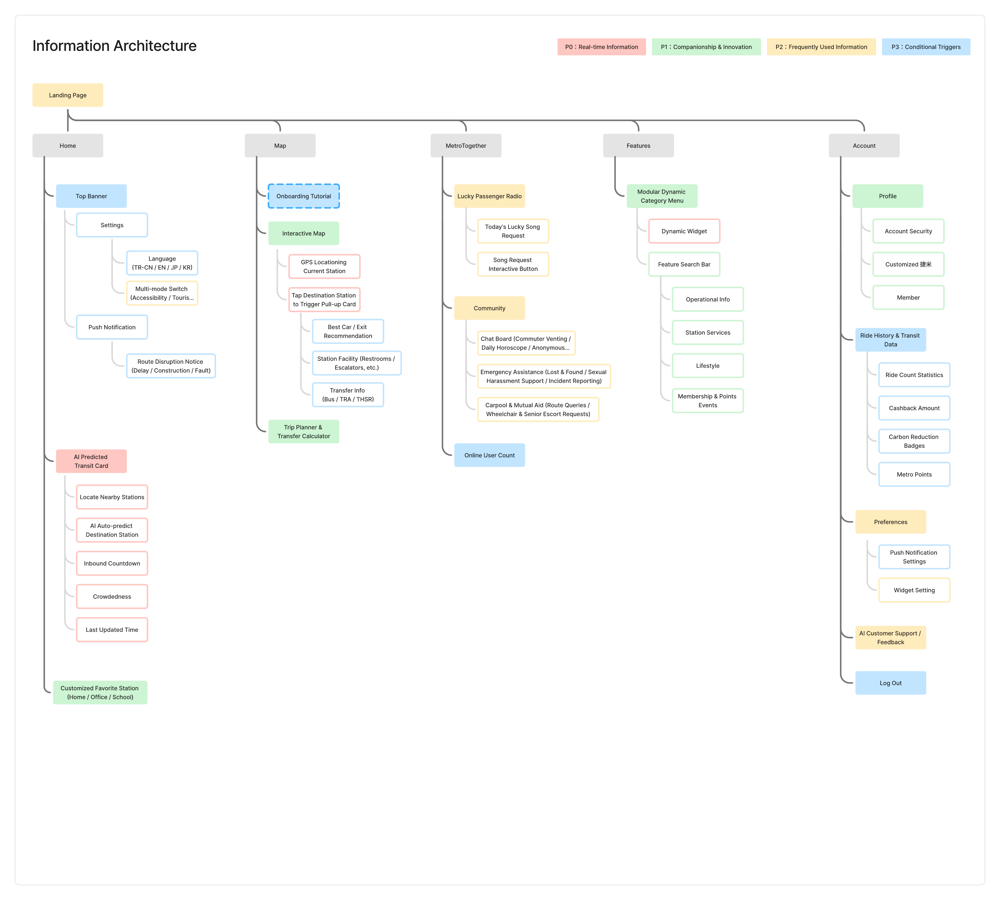

# UX Process & Insights

This UX Insights case study focuses on how I moved the project forward: from early exploration and problem definition, to divergent solution development, to completing a prototype within a short timeline, and then using Codex to re-examine the product structure through collaboration with AI.

## 1. Empathize | Understanding users and audience segments

### Research methods

The pre-proposal UX research included a survey conducted from **May 13–16, 2025**, followed by passenger interviews. The survey received **40 responses**.

The research methods included:

- **40 Google Form responses** focused on the needs of Taipei Metro passengers around real-time information, routes, transfers, and crowding.
- **4 passenger interviews** to understand the contexts in which these needs occurred, and how passengers described waiting, transfers, fatigue, frustration, and moments when they needed help.

I considered the two types of data together. The Google Form showed me which needs appeared repeatedly, while the passenger interviews helped me understand the behavior and emotions behind those needs. This kept the product from becoming only a collection of information fields.

### How the research shaped the product direction

#### 1. Train arrival time was the most essential real-time need

The arrival time at frequently used stations appeared in **92.5%** of responses, making it the clearest need in the survey. This showed that passengers rely on real-time train information to plan everyday commutes and trips, so I prioritized arrival time on the Home screen.

Crowding information revealed another opportunity: **42.5%** of respondents selected it as a preferred Home customization item. This suggested that its importance was higher than its intuitive usage level. My design direction was to combine crowding with train arrival time in the same journey-information module, using visual and color states such as “comfortable / moderate / crowded” to reduce reading effort.

#### 2. Route planning should focus on time and transfer dynamics

The need for route planning and transfer suggestions reached **77.5%** and showed a clear combined need with journey time lookup at **62%**. By comparison, fares and promotions were selected by only **27.5%** of respondents and were not a primary information need. This suggested that when planning cross-station travel, passengers first need to understand travel time and transfer conditions rather than receive complete fare information within the route-planning flow.

I therefore designed route planning as a focused module: after entering an origin and destination, the same flow provides route suggestions, estimated time, and transfer dynamics, allowing passengers to quickly judge which option is suitable. Fares and promotions are not treated as primary information in route planning and remain in other, more appropriate entry points.

The overall preference for an alighting reminder was **22.5%**. It was not strong enough to make it a universal Home feature, but it could still support long-distance or fatigued morning commuters. I treated it as optional contextual support instead of forcing it onto the Home screen.

Demand for card balance, points, and account management was relatively low. These functions were better placed in Apple Wallet, a transit-card account, or Account rather than occupying the Home space needed for immediate travel decisions.

These research insights expanded the product from a single app interface into an experience in which Home, route planning, and Widgets work together to support travel decisions.

### Moodboard and UX process after the survey

After completing the survey and interviews, I did not move directly into screen design. I first used a moodboard to organize the research into three travel contexts, then reviewed the existing metro app and other transportation apps with my teammates to identify interface issues and generate ideas together.

#### Three context storyboards



*Student commuter context: getting essential train information quickly while rushing and waiting, reducing uncertainty and anxiety.*



*Accessibility context: using voice prompts and simplified interactions to help passengers find the correct route and elevator.*



*Emotional companionship context: using music, interaction, and companionship to respond to fatigue and loneliness during the journey.*

#### Design principles from interface observation

The moodboard comparison also exposed several problems in the existing metro app: an oversized and commercial-looking Home banner, too many thin-line elements and pale blocks competing for attention, fragmented functions, and unclear primary entry points.

From the reference interfaces, I kept three directions: the simplicity of Japanese transportation apps, the clear grouping of payment apps, and the four prominent shortcuts used by a bus app. These observations became product design principles:

- show essential real-time information first and reduce distraction;
- make route search and journey planning the clearest primary action;
- reduce frequently used functions to a small number of understandable shortcuts;
- use bottom navigation for primary areas and move low-frequency functions into More or Account;
- treat user-customizable content as part of the product structure rather than decoration.

#### Moving from moodboard to IA

The final step of the moodboard was to translate observations into components, actions, system decisions, information blocks, and function buttons. I then organized them into the navigation skeleton of Home, Map, MetroTogether, Features, and Account. This became the shared starting point for the competition proposal and the post-competition IA iteration.

## 2. Define | Defining the actual problem

I did not define the problem as “build a more complete metro app.” I focused on the two areas where passengers most needed support when making travel decisions, and narrowed them into two How Might We questions:

- **HMW** help passengers grasp real-time information that affects their journey within a short amount of time?
- **HMW** reduce negative emotions such as anxiety, fatigue, or loneliness while passengers wait for and ride the metro?

After organizing the research findings further, I realized that passengers usually need more than “finding a route.” They need to decide what to do next based on their current situation: whether they can leave now and still make the train, whether they need to walk faster, which train is more suitable, and how to manage their state while waiting.

> When I take the metro to work or school every day, I need to know when to leave so I can catch the train at the right time. If I am running late, should I walk faster? After work, how long will I need to wait for the next train?

Therefore, the product’s core is not simply providing more information. It is helping passengers understand their situation quickly and make a choice at the right time.

## 3. Ideate | Turning insights into a product direction

I translated the research inputs into three connected directions:

1. **Reduce the cost of accessing real-time information and planning a journey:** use AI-powered personalized recommendations that combine the user’s context and habits, then proactively present potentially relevant information through a smart journey card and contextual shortcuts on Home, minimizing manual input and interaction.
2. **Place recommendations in context:** combine route, time, crowding, and personal conditions rather than returning only the fastest route.
3. **Keep the human side of travel visible:** use emotional companionship, music, mutual help, and MetroTogether to respond to passengers’ psychological states while waiting and riding.

The competition proposal also included an AI-enabled technical architecture using Firebase, AWS Lambda, and AWS Bedrock LLM to support behavior data, dynamic location, route planning, UI recommendations, station prediction, and AI-assisted customer service. This area was mainly handled by other team members. I treated it as part of the product direction and competition context, and represented how AI recommendations could enter the user flow in the prototype.

Technical overview: [AI technical overview](https://www.canva.com/design/DAGw1sl83c4/K83wtoP41e_NU1fRmC4lpg/view?utm_content=DAGw1sl83c4&utm_campaign=designshare&utm_medium=link&utm_source=viewer)

## 4. Prototype | Building the first presentable version under competition constraints

The competition required us to communicate the problem, innovation, technical feasibility, and prototype within a seven-minute presentation. I therefore divided the experience into modules that could be built and connected quickly:

- live journey and route information;
- contextual Home entry points;
- route map and station information;
- service categories and metro support;
- general and accessibility contexts;
- MetroTogether and emotional companionship.

I built the high-fidelity prototype for real-time journey information, Home, Route Map, station and service information. The [Figma final-demo prototype](https://www.figma.com/proto/467ZwEnIUOrVpREiduKbd5/%E8%A6%81%E4%B8%8D%E8%A6%81%E6%90%AD%E6%8D%B7%E9%81%8B?node-id=1-2&t=4C8RnnGyL7Vt3QZN-1) was primarily used to help judges understand the product concept and key flows quickly. The Accessibility and MetroTogether experiences were developed separately by other team members.

Because this version optimized for competition presentation, I prioritized a coherent story, key screens, and a demonstrable interaction flow. It communicated the product direction, but it did not fully answer the longer-term questions around navigation, information hierarchy, and feature scalability.

## 5. Evaluate | Learning from presentation and decomposition

The proposal and final demo helped me inspect whether the product could be understood quickly. They also exposed the limits of the competition version:

- Feature highlights could become more prominent than task priority.
- AI, dual modes, and MetroTogether were strong ways to communicate innovation, but they could make the product feel like a feature showcase.
- Users needed to understand the product story before knowing where to begin.
- A competition prototype can present a complete concept in one sequence, but real passengers may not explore it in that sequence.

Therefore, I did not treat the competition version as the final product. I treated it as an MVP that had been presented and now needed to be examined again.

## 6. Iterate with AI | How I collaborated with Codex

I chose to use Codex for the next iteration because I learned a rapid MVP validation approach while participating in the 2026 iOS Summer Hackathon and developing **Snoots!**: make a focused version tangible, identify the highest-risk assumptions, and use what I observe to decide what to refine next.

### The collaboration loop

I used Codex inside the design iteration without handing over the design judgment:

```text
I define the problem and hypothesis
          ↓
I translate the information architecture and tasks into explicit requirements
          ↓
Codex helps build or modify the SwiftUI / web prototype
          ↓
I inspect screens, navigation, naming, and task flow
          ↓
I iterate with Codex on the specific issues
          ↓
I keep, revise, or discard the next direction
```

### Where Codex helped

- Turning information-architecture assumptions into interactive screens and navigation quickly.
- Supporting repetitive UI structure, state, and prototype-flow implementation.
- Making it possible to compare different Home hierarchies, entry points, and content groupings.
- Providing an inspectable iOS and web version after each focused change.

### What remained my responsibility

- Deciding which user problem to solve.
- Interpreting research and interview context.
- Defining information priority, naming, and task success conditions.
- Judging whether an AI-generated implementation fit the product direction.
- Selecting the next iteration based on inspection rather than adding features indiscriminately.

## 7. Iteration outcome | From feature showcase to an understandable product

Through this AI-assisted iteration, I moved the product from a competition-led feature story toward an information-architecture-first structure:



*Post-competition English IA: the product is organized around Home, Map, MetroTogether, Features, and Account.*

The focus of this iteration was not to add more features, but to answer three questions again:

1. Does the user know what they can do after opening the product?
2. Is each type of information placed where users would expect it?
3. Does AI support the task without asking users to understand AI first?

### Post-competition IA version: from feature list to priority layers

After the competition, I reorganized the IA to re-check where every feature belonged. This iteration did not only group features into five primary areas; it also introduced four priority layers so that the product could present information according to usage context and decision importance:

| Priority layer | Definition | Representative content |
| --- | --- | --- |
| **P0: Real-time information** | Information the passenger needs immediately and that directly affects the travel decision | AI-predicted journey card, nearby station, destination prediction, inbound countdown, crowding, last-updated time, service disruption |
| **P1: Companionship and innovation** | Emotional support, mutual aid, and new forms of lightweight interaction | Lucky Passenger Radio, song requests, community, emergency assistance, carpool and mutual aid, online user count |
| **P2: Frequently used information** | Functions passengers revisit regularly but may not need every time they open the app | Dynamic category menu, feature search, operational information, station services, lifestyle, membership and points events |
| **P3: Conditional triggers** | Functions that appear only under a specific context, permission, or intentional action | Language, modes, push settings, account security, AI customer service, logout |

This separation helped me distinguish “what should appear first on Home?” from “what exists in the complete product?” The five primary areas remain Home, Map, MetroTogether, Features, and Account. P0–P3 then determine priority and trigger conditions within those areas.

## My design judgments

### Address the decision before the feature

I positioned Home as a decision entry point. It gives passengers context first, then lets them move into route details, services, or companionship when needed.

### Keep AI in the service layer

AI can support recommendations and prediction, but it should not remove the user’s control over origin, destination, route, or mode. I therefore kept manual adjustment and a path back to conventional interaction.

### Make the information architecture extensible

Once features have clear primary areas, future real-time data, station services, or personalization can be added without reinventing the product skeleton.

### Treat accessibility as structural

Accessibility is not only a visual-style concern. It includes information priority, alternative representations, interaction paths, and support entry points. These requirements need to appear in the product structure from the beginning. At the same time, AI prediction and personalized recommendations need clear data sources, update times, understandable reasons, and user-controlled adjustments to build trust with the target audience rather than becoming an opaque black box.

## Areas for further improvement

The current version establishes a product structure and an interactive prototype. There are still several areas I can continue improving:

- Help users understand the recommendation and the next available action more quickly when they first open Home.
- Further clarify the information hierarchy between time, transfers, crowding, and comfort to reduce the cost of comparison and decision-making.
- Continue checking the naming and responsibilities of Home, Route Map, Services, MetroTogether, and Account so that the navigation better matches users’ mental models.
- Make accessibility and station support easier to find when needed, and complete alternative interaction paths for different contexts.
- Improve the understandability and controllability of AI recommendations so users can see why a recommendation was made and can adjust, reject, or correct it.

I will continue using prototype reviews, task-flow decomposition, and checks against real travel contexts to observe findability, comprehension, navigation confidence, and decision confidence. I will then translate the findings into the next round of improvements to the information architecture, content hierarchy, and interaction details.

## Project outcomes

- Received 3rd place in the 2025 Taipei Metro Hackathon.
- Completed pre-proposal UX Discovery through 40 Google Form responses and 4 passenger interviews.
- Built the competition prototype for real-time journey information, Home, Route Map, station and service information, and general and tourist contexts.
- Translated research insights into product direction, task flow, and information architecture.
- Used Codex after the competition to continue iterating the product, focusing on presenting the information architecture clearly and validating a rapid MVP.
- Practiced using AI to accelerate implementation while retaining ownership of research interpretation and product decisions.
