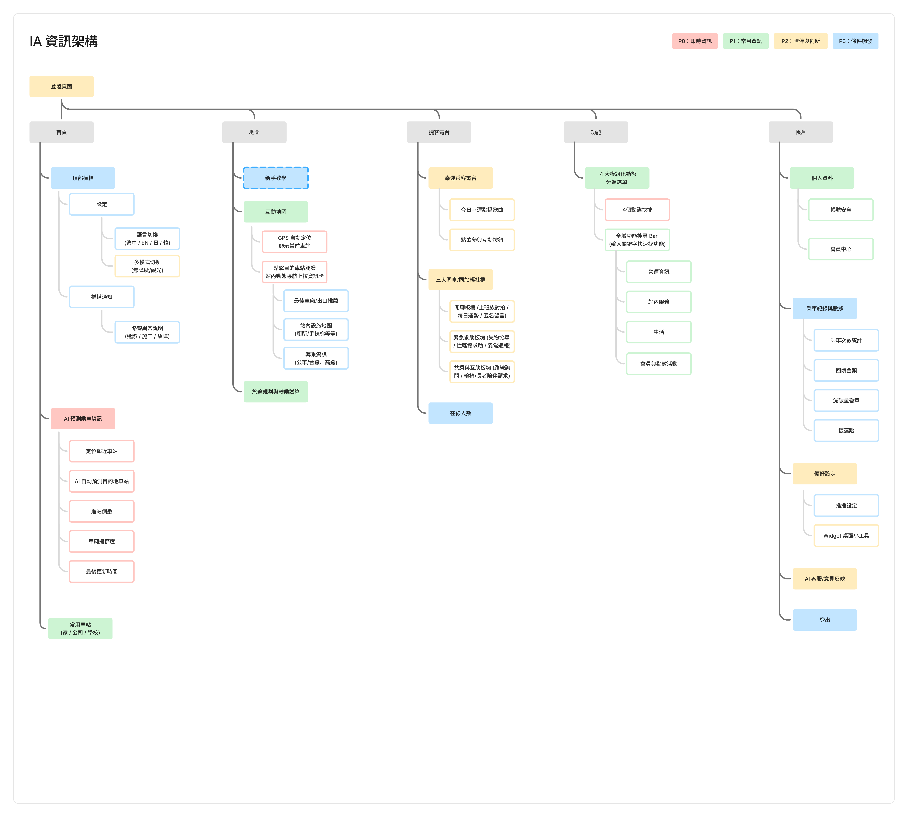

# UX Process & Insights

這份 UX Insights 著重在我的推進過程：我如何從前期探索、定義問題、發散解法、並在短期的時間下完成原型，以及後續如何透過 Codex 協作重新檢查產品結構。

## 1. Empathize｜理解使用者與受眾區分

### 研究方法

提案前的 UX research 包含一份於 **2025 年 5 月 13–16 日**進行的問卷，以及後續乘客訪談。問卷共收到 **40 份回覆**。

研究方法包含：

- **40 份 Google Form 回覆**：針對北捷核心乘客在即時資訊、路線、轉乘與擁擠度上的需求分布。
- **4 位乘客訪談**：理解需求發生的情境，以及乘客如何描述等待、轉乘、疲憊、焦躁與需要協助的時刻。

我把兩種資料放在一起看。Google Form 讓我看到哪些需求反覆出現；乘客訪談則讓我理解這些需求背後的行為與情緒，避免只把產品做成資訊欄位的集合。

### 研究洞察如何影響產品方向

#### 1. 列車進站時間是最核心的即時需求

「常用車站的列車進站時間」出現率達 **92.5%**，是問卷中最明顯的需求。這表示乘客會依賴即時列車資訊安排日常通勤與行程，因此我把到站時間放在產品首頁的優先位置。

即時擁擠度則呈現另一種機會：有 **42.5%** 的使用者將它列為自訂首頁項目，代表它的重要性高於單純的功能使用率。我的設計方向是把擁擠度與列車進站時間放在同一個旅程資訊模組中，並使用圖像與顏色呈現「舒適／普通／擁擠」，降低閱讀成本。

#### 2. 路線規劃僅保留時間與轉乘動態

「路線規劃與轉乘建議」的需求達 **77.5%**，並與「查詢車程時間」**62%** 呈現明顯的組合需求；相較之下，「票價與優惠」僅有 **27.5%**，並非主要資訊。這代表乘客在規劃跨站移動時，優先需要掌握行程時間與轉乘狀況，而不是在路線規劃流程中取得完整的票價資訊。

因此，我將路線規劃設計成聚焦式模組：輸入起訖站後，同一個流程中提供路線建議、所需時間與轉乘動態，讓使用者能快速判斷目前適合的走法。票價與優惠則不作為路線規劃中的主要資訊，保留在其他較適合的功能入口中。

「下車提醒」的整體偏好度為 **22.5%**，不適合被視為所有人的首頁核心功能，但對長距離或早晨疲勞的乘客仍有價值。我將它視為可依情境開啟的通勤輔助，而不是強制放在首頁。

票卡餘額、點數與帳戶管理的需求相對低，因此更適合整合到 Apple Wallet、票卡帳戶或 Account，而不是佔用首頁的即時決策空間。

這些研究洞察讓我把產品從單一 App 介面延伸成「首頁、路線模組與 Widget 共同支援旅程決策」的體驗。

### 問卷後的 Moodboard 與 UX process

問卷與訪談完成後，我沒有直接進入畫面設計，而是先用 moodboard 把研究結果整理成三組使用情境，再對照現有捷運 App 與其他交通等 App 的介面問題與團隊成員一起集思廣益。

#### 三組情境 Storyboard


*學生通勤情境：在趕車與等待的過程中，快速取得班次資訊並降低焦慮。*


*無障礙情境：透過語音提示與簡化操作，協助使用者找到正確路線與電梯。*


*情緒陪伴情境：以音樂、互動與陪伴，回應等待與搭乘中的疲憊或孤單。*

#### 從介面觀察形成設計原則

Moodboard 中的介面比較也揭露了目前捷運 App 的幾個問題：首頁 Banner 過大且商業感強、線條與淺色塊太多而缺乏焦點、功能過度分散，以及使用者難以判斷哪一個入口最重要。

我從參考介面中保留三個方向：日本交通 App 的簡潔、支付 App 的清楚分區，以及公車 App 的四個常用工具。這些觀察後來轉化成產品設計原則：

- 首頁先顯示最重要的即時資訊，降低干擾。
- 以明顯的路線搜尋與旅程規劃作為主要操作入口。
- 將常用功能收斂成少量、可理解的快捷入口。
- 使用底部導覽承載主要頁面，把低頻功能放進「更多」或帳戶。
- 將使用者可自訂的內容視為產品結構的一部分，而不是額外裝飾。

#### 從 Moodboard 走向 IA
Moodboard 的最後一步是把觀察轉成元件、動作、系統決策、資訊區塊與功能按鈕，再進一步整理成首頁、地圖、捷客電台、功能與帳戶的導覽骨架。這也是後續競賽提案與競賽後 IA 迭代的共同起點。

## 2. Define｜定義真正要解決的問題

我沒有把問題定義成「如何做一個更完整的捷運 App」，而是聚焦在乘客做決策時最需要被支援的兩個面向，收斂成兩個 How Might We：

- **HMW** 讓乘客在短時間內掌握會影響行程的即時資訊？
- **HMW** 讓乘客在等待與搭乘過程中，減少焦躁、疲憊或孤單等負面感受？

進一步整理研究結果後，我發現乘客需要的通常不只是「查到一條路線」，而是根據當下情境判斷下一步該怎麼做：現在出門是否來得及、是否需要加快腳步、哪一班車較適合，以及等待期間如何調整自己的狀態。

> 當我每天都搭捷運上班或上課，我需要知道什麼時候出門才能剛好搭上車；如果快來不及了，我要不要加快腳步？下班時，下一班車還要等多久？

因此，產品的核心不只是提供更多資訊，而是協助乘客在正確的時間，快速理解情境並做出選擇。

## 3. Ideate｜從洞察形成產品方向

我把研究輸入轉化成三個互相連接的方向：

1. **降低取得即時資訊與規劃旅程的成本**：透過 AI 個人化推薦，結合使用者情境與習慣，在首頁以智慧旅程卡與情境捷徑主動提供可能需要的資訊，盡可能減少手動輸入與操作。
2. **把推薦放在情境裡**：結合路線、時間、擁擠度與個人條件，不只回傳單一最快路線。
3. **讓旅程保留人的感受**：透過情緒陪伴、音樂、互助與 MetroTogether，回應等待與搭乘中的心理狀態。

競賽提案也包含 AI 賦能的技術架構，使用 Firebase、AWS Lambda 與 AWS Bedrock LLM 支援行為資料、動態定位、路線規劃、UI 推薦、站點預測與 AI 客服。這部分主要由團隊其他成員負責，我把它視為產品方向與競賽技術脈絡的一部分，並在 prototype 中呈現 AI 建議如何進入使用者流程。

詳細技術說明：[AI technical overview](https://www.canva.com/design/DAGw1sl83c4/K83wtoP41e_NU1fRmC4lpg/view?utm_content=DAGw1sl83c4&utm_campaign=designshare&utm_medium=link&utm_source=viewer)

## 4. Prototype｜在競賽限制下完成第一個可展示版本

競賽版本需要在 7 分鐘內說清楚問題、創新概念、技術可行性與 prototype。因此，我將體驗拆成可以快速製作和串接的區塊：

- 即時旅程與路線資訊
- 首頁情境入口
- 路線圖與站點資訊
- 服務分類與捷運支援
- 一般與無障礙情境
- MetroTogether 與情緒陪伴

我負責即時旅程資訊、首頁、路線圖、車站與服務資訊的高擬真原型製作。競賽版本的 [Figma final-demo prototype](https://www.figma.com/proto/467ZwEnIUOrVpREiduKbd5/%E8%A6%81%E4%B8%8D%E8%A6%81%E6%90%AD%E6%8D%B7%E9%81%8B?node-id=1-2&t=4C8RnnGyL7Vt3QZN-1) 主要任務，是讓評審在短時間內理解產品概念與使用流程。

這個版本以競賽呈現為優先，所以我先確保故事線、主要畫面與互動流程能夠被快速理解。它完成了產品方向的溝通，但還沒有完整回答長期使用時的導覽、資訊層級與功能擴充問題。

## 5. Evaluate｜從展示與拆解中發現問題

競賽提案與決賽 demo 讓我檢視了產品是否能在短時間內被理解，也讓我看見競賽版本的限制：

- 功能亮點容易比任務優先級更醒目。
- AI、雙模式與 MetroTogether 很適合用來說明創新，但可能讓產品看起來像功能展示板。
- 使用者需要先理解產品故事，才知道下一步應該從哪一個入口開始。
- 競賽版本適合一次展示完整概念，不代表真實使用者會以同樣順序探索功能。

因此，我沒有把競賽版本直接視為最終產品，而是把它當成一個已經被展示過、接下來需要重新檢查的 MVP。

## 6. Iterate with AI｜我如何與 Codex 協作

我選擇使用 Codex 迭代，是因為我在參與 2026 iOS Summer Hackathon 開發 **Snoots!** 時，學到快速 MVP 驗證的方法：先做出一個可被檢視的版本，再找出最高風險的假設，依據觀察決定下一輪設計。

### 協作循環

我把 Codex 放進設計迭代，而不是把設計判斷交給 AI：

```text
我定義問題與假設
        ↓
我把資訊架構與任務拆成明確需求
        ↓
Codex 協助建立或修改 SwiftUI / Web prototype
        ↓
我檢查畫面、導覽、命名與任務流程
        ↓
我與 Codex 針對問題快速迭代
        ↓
我保留、修改或捨棄下一輪方向
```

### Codex 協助我的部分

- 將資訊架構假設快速轉成可操作的畫面與導覽。
- 協助建立重複性高的 UI 結構、狀態與 prototype flow。
- 讓我能快速比較不同的首頁層級、入口位置與內容分組。
- 在每次修改後提供可以直接檢查的 iOS 與 Web 版本。

### 仍由我負責的部分

- 決定要解決哪一個使用者問題。
- 解讀研究資料與訪談脈絡。
- 定義資訊優先級、命名與任務成功條件。
- 判斷哪些 AI 產出的實作符合產品方向。
- 根據 prototype 的檢查結果選擇下一輪迭代，而不是盲目增加功能。

## 7. Iteration outcome｜從功能展示轉向可理解的產品

透過這次 AI 協作迭代，我把產品從競賽版本的功能敘事，推進成資訊架構優先的產品結構：


*競賽後重新整理的繁體中文 IA：以首頁、地圖、捷客電台、功能與帳戶為主要入口。*

這次迭代的重點不是增加更多功能，而是重新回答三個問題：

1. 使用者打開產品後，是否知道現在可以做什麼？
2. 不同資訊是否被放在合理且可預期的位置？
3. AI 建議是否服務於任務，而不是要求使用者先理解 AI？

### 競賽後 IA 版本：從功能清單改成優先層級

競賽後我重新整理 IA，檢查所有功能在產品中的位置。這次迭代不只是把功能分到五個主要入口，也增加了四個優先層級，讓產品能依照使用時機與決策重要性呈現資訊：

| 優先層級 | 定義 | 代表內容 |
| --- | --- | --- |
| **P0｜即時資訊** | 使用者現在就需要知道、會直接影響旅程決策的資訊 | AI 預測旅程卡、鄰近車站、目的地預測、進站倒數、擁擠度、最後更新時間、路線異常 |
| **P1｜陪伴與創新** | 支援情緒、互助與新型態互動的體驗 | 幸運乘客電台、點歌、社群、緊急協助、共乘互助、線上人數 |
| **P2｜常用資訊** | 使用者會反覆查找，但不一定在每次開啟時立即需要的功能 | 動態分類選單、功能搜尋、營運資訊、站內服務、生活、會員與點數活動 |
| **P3｜條件觸發** | 只有在特定情境、權限或使用者主動操作時出現的功能 | 語言、多模式、推播設定、帳戶安全、AI 客服、登出 |

這個分層讓我把「首頁要先呈現什麼」和「完整產品有哪些功能」分開處理。五個主要入口維持為 Home、Map、MetroTogether、Features 與 Account；P0–P3 則用來判斷內容在各入口中的優先級與觸發條件。

## 我的設計判斷

### 先處理決策，再處理功能
我將首頁定位成決策入口，讓使用者先理解目前情境，再決定是否查看完整路線、服務或陪伴功能。

### 將 AI 放在服務層
AI 可以協助推薦與預測，但不能取代使用者對起點、目的地、路線與模式的控制。我因此保留手動調整和回到一般操作流程的路徑。

### 讓資訊架構支撐後續擴充
把功能放進清楚的一級入口後，未來新增即時資料、車站服務或個人化設定時，不需要重新發明整個產品骨架。

### 把無障礙視為結構問題
無障礙不只是視覺樣式，也包含資訊優先級、替代呈現方式、操作路徑與協助入口。這些要求需要在產品結構中先被看見。同時，AI 預測與個人化推薦也需要透過清楚的資訊來源、更新時間、可理解的推薦理由與使用者可控的調整方式，建立目標受眾對科技的信任感，而不是讓技術成為難以理解的黑盒子。

## ## 後續可以再進步的地方

目前版本完成的是產品結構與可操作 prototype，接下來仍有幾個方向可以持續改善：

- 讓使用者在第一次開啟首頁時，更快理解推薦內容與目前可以採取的行動。
- 進一步整理時間、轉乘、擁擠度與舒適度之間的資訊層級，降低比較與判斷的成本。
- 持續檢查 Home、Route Map、Services、MetroTogether 與 Account 的命名與分工，讓導覽更符合使用者的 mental model。
- 讓無障礙與車站支援在需要時更容易被找到，並完善不同情境下的替代操作路徑。
- 提升 AI 推薦的可理解性與可控性，讓使用者能看懂推薦原因，也能自行修正、調整或拒絕建議。

後續我會持續透過 prototype review、任務流程拆解與實際使用情境檢查，觀察 findability、理解程度、navigation confidence 與 decision confidence，並將發現轉化為下一輪的資訊架構、內容層級與互動細節改善。

## 專案成果

- 2025 捷運盃黑客松季軍。
- 以 40 份 Google Form 回覆與 4 位乘客訪談完成提案前 UX Discovery。
- 在競賽版本中完成即時旅程資訊、首頁、路線圖、車站與服務資訊，以及一般與觀光情境的 prototype 製作。
- 將研究洞察轉化為產品方向、任務流程與資訊架構。
- 競賽後使用 Codex 持續迭代產品，專注於資訊架構的呈現與快速 MVP 驗證。
- 練習以 AI 加速實作，同時保留研究解讀與產品決策的主導權。
